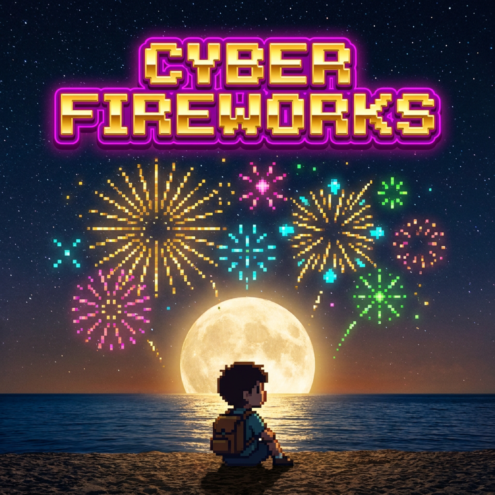
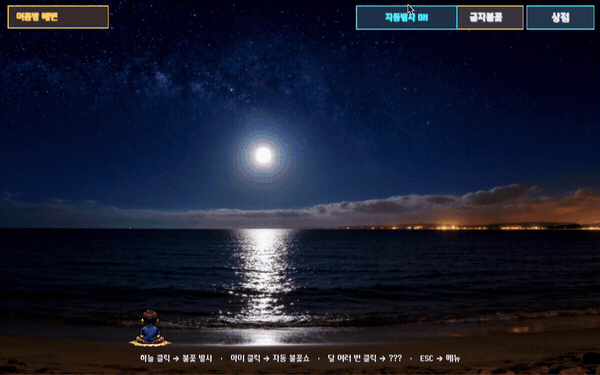
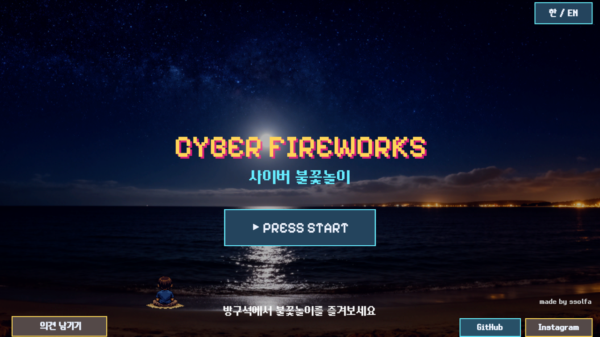
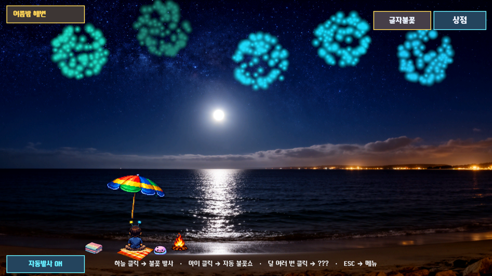
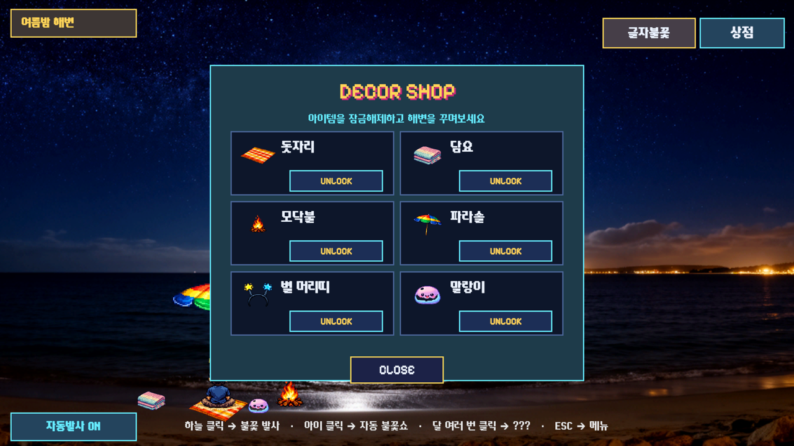

# 🎆 사이버 불꽃놀이 · Cyber Fireworks

**방구석에서 즐기는 여름밤 불꽃놀이** - A cozy fireworks night, right from your room.

---

## 🌙 Intro

불꽃놀이는 원래 남이 해주는 게 제일 맛있잖아요. 그래서 돈 안 들이고 방구석에서 여름밤 불꽃놀이 즐기는 방법을 만들었습니다.

실사 밤바다 위로 픽셀 감성 불꽃을 터뜨리며 힐링하는 웹게임이에요.

클릭 한 번으로 불꽃을 쏘고, 하늘에 하고 싶은 말을 글자 불꽃으로 써보고, 해변을 아이템으로 꾸며보세요.

잔잔한 파도소리를 들으면서 마음의 평화를 찾아보세요.

혹시 밤이 지겨워지면, 달을 자꾸 쳐다보는 것도 방법이에요 🌙

**바로 플레이 → [cyber-fireworks.vercel.app](https://cyber-fireworks.vercel.app)**
> PC 접근을 추천드려요 🫶 마우스로 클릭감을 느껴보세요 💃

## 🎬 Demo

## 📸 ScreenShot

| 시작 화면 | 불꽃놀이 | 꾸미기 상점 |
|---|---|---|
|  |  |  |

## 🛠️ Skills

- **Unity 6 (URP 2D) · WebGL · Vercel**
- **글자 불꽃** - 입력한 텍스트를 폰트로 래스터라이즈 → 픽셀 샘플링 → 파티클 위치로 변환해 하늘에 그림 (한글 지원)
- **WebGL `.jslib` 브릿지** - Unity 기본 입력이 못 하는 한글 IME를 브라우저 네이티브 입력으로 우회
> 배경·캐릭터·사운드 등 에셋은 모두! Unity AI로 생성했어요.

## 🔗 링크

- **Play**: [cyber-fireworks.vercel.app](https://cyber-fireworks.vercel.app) · [itch.io](https://ssolfa.itch.io/cyber-fireworks)
- **개발기 / Devlog**: [게임도 바이브코딩이 된다고? ...진짜 되네](https://5ffthewall.tistory.com/145)

## 📄 License

MIT © ssolfa

개발에 [Claude Code](https://claude.com/claude-code)를 활용했습니다 🤖

